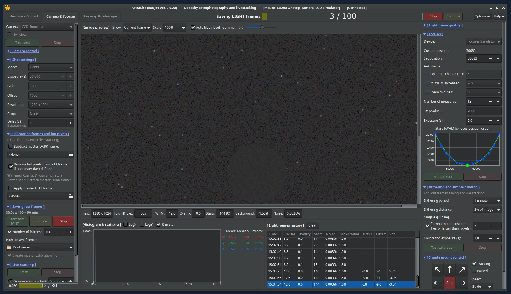

# AstraLite
AstraLite is software for deepsky astrophotography and live stacking
on low power PCs (like rapsberry Pi or Orange Pi)

```diff
! The program is under active development!
```

AstraLite uses INDI server to work with astrophotography hardware.
See https://www.indilib.org/download.html to install INDI

Compiled binaries and discussion here: https://www.indilib.org/forum/clients/13006-astralite-simple-indi-client-for-astrophotography.html

# Features
* UI for INDI devices control
* Live images preview
* Saving RAW frames
* Live stacking
* Dark and flat files creation
* Light frame quality filter
* Simple guiding by main camera
* Dithering
* Autofocus
* Manual mount control



# How to build AstraLite
## Prerequisites for Linux
* Rust compiler: https://www.rust-lang.org/tools/install
* Libs and tools:
```
sudo apt install gcc libgtk-3-dev build-essential libcfitsio-dev
```

## Prerequisites for MS Windows
* Rust compiler (i686-pc-windows-**gnu**): https://www.rust-lang.org/tools/install
* MSYS: https://www.msys2.org/
* Libs and tools (type inside MSYS command line):
```
pacman -S mingw-w64-x86_64-cfitsio
pacman -S mingw-w64-x86_64-gtk3 mingw-w64-x86_64-pkg-config
pacman -S base-devel mingw-w64-x86_64-gcc
```

Don't forget to set your `PATH` environment variable to point to the `mingw64\bin` directory of MSYS

## How to build
To build optimized binaries just type
```
cargo build --release
```
