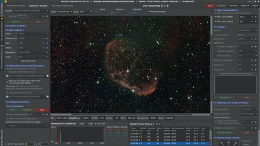

# AstraLite
AstraLite is software for deepsky astrophotography and live stacking
on low power PCs (like rapsberry Pi or Orange Pi)

```diff
! The program is under active development !
```

AstraLite uses INDI server to work with astrophotography hardware.
See https://www.indilib.org/download.html to install INDI

Compiled binaries and discussion here:
https://www.indilib.org/forum/clients/13006-astralite-simple-indi-client-for-astrophotography.html

# Features
* Saving RAW frames
* Live stacking with **automatic satellites and meteors track removal**
* Darks, biases and defective pixels library
* Light frames quality filter
* Guiding and dithering by PHD2 or **main camera**
* Autofocus
* Sky map
* Plate solving
* Manual mount control
* UI for INDI devices control

# Requirements
| Condition                        | Requiriment                    |
|----------------------------------|--------------------------------|
| Astrophotography only            | >= 2 CPU cores, >= 2 GB of RAM |
| Live staking                     | >= 4 CPU cores, >= 2 GB of RAM |
| Live staking with tracks removal | >= 4 CPU cores, >= 4 GB of RAM |

# Screenshots
[](./docs/screenshot1.jpg)

# Future plans
* Mount polar alignment
* INDI driver crash recovery
* Live view from camera in video mode
* Meridian flip support

# How to build AstraLite
## Prerequisites for Linux
* Rust compiler: https://www.rust-lang.org/tools/install
* Libs and tools:
```
sudo apt install gcc libgtk-3-dev build-essential
```

## Prerequisites for MS Windows
* Rust compiler (i686-pc-windows-**gnu**): https://www.rust-lang.org/tools/install
  Note! You have to install *-gnu (not *-msvc) toolchain:
```
rustup-init.exe --default-toolchain=stable-x86_64-pc-windows-gnu --default-host=x86_64-pc-windows-gnu
```
* MSYS: https://www.msys2.org/
* Libs and tools (type inside MSYS command line):
```
pacman -S mingw-w64-x86_64-gtk3
pacman -S mingw-w64-x86_64-pkg-config base-devel mingw-w64-x86_64-gcc
```

Don't forget to set your `PATH` environment variable to point to the `mingw64\bin` directory of MSYS

# How to build for you platform
To build optimized binaries for your current platform, just type
```
cargo build --release
```
# Building and creating deb-packages for arm64, armhf and x64_86 platforms
## Prerequisites
* Install podman or docker (I prefer podman):
```
sudo apt install podman
```
* Install `cross` https://github.com/cross-rs/cross :
```
cargo install cross --git https://github.com/cross-rs/cross
```
## How to build
Execute `build_cross.sh`. Once `build_cross.sh` has finished running, you will find the deb packages in the `dist` folder.

# Data sources
DSO:
* Messier, NGC and IC catalogue from OpenNGC - https://github.com/mattiaverga/OpenNGC
* Caldwell catalogue - http://www.hawastsoc.org/deepsky/caldwell.html
* DSO nicknames list - https://www.astrobin.com/fg7b5l/

Stars:
* Tycho-2 catalogue - https://www.cosmos.esa.int/web/hipparcos/tycho-2
* HYG v3 catalogue - https://github.com/astronexus/HYG-Database/tree/main/hyg/v3
