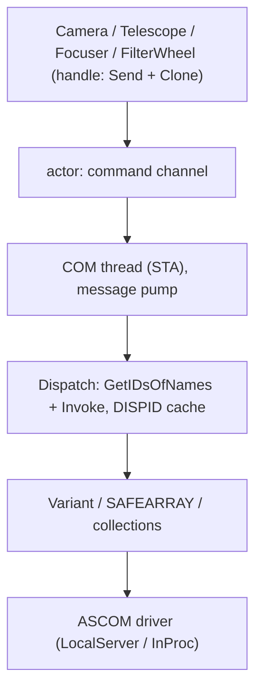

# ascom — ASCOM Classic (COM) in Rust

A production-oriented wrapper over **classic ASCOM/COM** (not Alpaca):
`ITelescopeV4`, `IFocuserV4`, `ICameraV4`, `IFilterWheelV3` on top of pure late binding
(`IDispatch::GetIDsOfNames` + `IDispatch::Invoke`).

Windows only. COM drivers only. The Alpaca transport is a separate project.



## What is here

| Module | Purpose |
|---|---|
| `src/com/` | The only place with `unsafe`: `apartment`, `variant`, `safearray`, `dispatch`, `collections`, `registry`, `mock` (test COM objects) |
| `src/error.rs` | Error model based on the ASCOM exception table (`AscomErrorKind`), `is_transient` / `is_unsupported` / `is_disconnected` |
| `src/actor.rs` | One COM thread per device; the handle is a `Send + Clone` sender of closures |
| `src/device.rs` | Members shared by the interfaces, `DeviceSpec`, `CapabilitySnapshot`, `StateValue` |
| `src/wait.rs` | A single mechanism for waiting on completion properties (`WaitSpec`, `wait_flag_true/false`) |
| `src/telescope.rs`, `src/focuser.rs`, `src/camera.rs`, `src/filterwheel.rs` | Interface wrappers |
| `src/image.rs` | `ImageArray` → frame: detecting the memory layout, FITS |
| `src/chooser.rs` | `ASCOM.Utilities.Chooser` (modal dialog — manual interaction only) |
| `src/drivers.rs` | Programmatic list of installed drivers: `installed_drivers` / `installed_prog_ids` |

## Setting up the environment

1. **ASCOM Platform 7** (required for any live check): the `ASCOM Platform 7.1.x`
   installer from <https://github.com/ASCOMInitiative/ASCOMPlatform/releases>.
   Check the version with:
   `reg query "HKLM\SOFTWARE\WOW6432Node\ASCOM\Platform" /v "Platform Version"`.
2. **OmniSimulators** driver simulators (installed together with Platform 7):
   ProgIDs `ASCOM.OmniSim.Telescope`, `ASCOM.OmniSim.Focuser`, `ASCOM.OmniSim.Camera`,
   `ASCOM.OmniSim.FilterWheel`.
3. Rust: any stable `x86_64-pc-windows-msvc` or `-gnu` toolchain.
   **A 32-bit build is not needed**: the OmniSim CLSID-s are registered only under
   `WOW6432Node` as 32-bit `LocalServer32`, and a 64-bit client activates them
   successfully (verified).

## Build and unit tests

```sh
cargo check --all-targets
cargo test              # everything together: unit, doctests and live tests (~50 s)
cargo doc --no-deps     # no warnings
```

The unit tests cover `VARIANT` marshalling, SAFEARRAY, frame layouts, FITS, the error
code table and the late binding layer against **in-process COM mocks**
(`src/com/mock.rs`: `IDispatch` collections with `NewEnum`/`Count`/`Item` using different
index bases, plus a broken and an infinite `IEnumVARIANT`).

`--features mock` hands the same mocks to a dependent crate as a driver-injection seam
(`Camera::open_mock` and friends, plus `ascom::mock::{Element, Member}`); that is how the
`astra_lite` HAL tests a failed activation without a driver installed. The mocks
themselves stay crate-internal — only the member vocabulary is public, and `Connected` is
the writable `Member::Flag` a test can observe.

## Live examples (Platform 7 required)

The default ProgID is OmniSim, overridable through the environment variables
`ASCOM_TELESCOPE_PROG_ID`, `ASCOM_FOCUSER_PROG_ID`, `ASCOM_CAMERA_PROG_ID`,
`ASCOM_FILTERWHEEL_PROG_ID` (for `probe`: `ASCOM_PROG_ID` or the first command-line
argument).

```sh
cargo run --example probe -- ASCOM.OmniSim.Camera
cargo run --example focuser
cargo run --example telescope
cargo run --example camera
cargo run --example filterwheel
cargo run --example list_drivers  # driver list, does not use COM
cargo run --example chooser       # ASCOM Chooser modal dialog, manual
```

- `probe` — a diagnostic sweep: it treats nothing as a failure and prints both values
  and errors (including the `NotConnected`/`Unsupported` answers from drivers that
  respond that way on their own).
- `camera` — deliberately a **non-square** subframe 96×48 (a square one cannot reveal a
  transpose), a real exposure, `FITS` written to a temporary directory. You can verify
  the file with: `python scripts/fits_check.py <path.fits>`.
- `list_drivers` — prints the registered drivers for every device family
  (limitable: `-- Camera`). Registry only, no COM objects are created.

## Finding drivers

There are two ways to learn what you can talk to:

- `chooser::choose(DeviceType::Telescope, None)` — the platform's own modal window
  (`ASCOM.Utilities.Chooser`): it needs a human and a desktop;
- `drivers::installed_drivers(DeviceType::Telescope)` / `installed_prog_ids(..)` — no
  dialog and no COM: a `Vec<DriverInfo>` with ProgID and description, sorted by ProgID.

There is no COM way to get that list: `ASCOM.Utilities.Chooser` only exposes
`DeviceType` and `Choose`, and requesting `Drivers` answers `DISP_E_UNKNOWNNAME`
(`0x80020006`) — verified through `IDispatch` on Platform 7.1. So the list is built from
the registration keys `HKLM\SOFTWARE\ASCOM\<family> Drivers\<ProgID>` — according to the
platform documentation a driver appears in Chooser only after being registered in these
keys. `src/com/registry.rs` reads both registry views (64-bit and `WOW6432Node`) in both
hives (`HKLM`, `HKCU`) and merges them: on this machine all 52 registered drivers are
visible **only** in the 32-bit view, and `HKLM\SOFTWARE\ASCOM` does not exist at all in
the 64-bit one.

A missing key is not an error but an empty list (a machine without ASCOM is reported the
same way). An existing entry does not guarantee the driver loads, so activation errors
from `DeviceSpec` are considered normal for stale registrations.

## Contract tests against a live driver

The live tests run under plain `cargo test`: a platform with simulators is assumed to be
installed, so they need no `#[ignore]`. Two of their properties are worth keeping in
mind:

- a run takes ~50 s versus fractions of a second for the unit tests;
- they **move hardware** — they unpark and turn the mount, drive the focuser, write a
  wheel slot and an exposure, and the simulator state survives the process. So only
  simulators make sense in `ASCOM_*_PROG_ID`, and `cargo test --test <suite>` is the way
  to leave the other devices alone.

```sh
cargo test --nocapture    # everything together
cargo test --test camera  # one suite
```

Every live test is marked `#[serial]` (dev-dependency `serial_test`): the simulator is one
shared Singleton application for all tests, and within a suite the tests run one at a time
automatically, so `--test-threads=1` is no longer required. It stays a cheap safety net: an
`#[serial]` forgotten on a new test silently gives a parallel run again, and it does not
work across two `cargo test` processes (or `cargo nextest`) — different cargo suites are
run sequentially anyway.

Separate suites:

```sh
cargo test --test focuser
cargo test --test telescope
cargo test --test camera
cargo test --test filterwheel
cargo test --test drivers      # registry only, no simulator needed
```

Environment variables: `ASCOM_TELESCOPE_PROG_ID`, `ASCOM_FOCUSER_PROG_ID`,
`ASCOM_CAMERA_PROG_ID`, `ASCOM_FILTERWHEEL_PROG_ID` (ProgIDs), `ASCOM_STRICT_SPEC=1` —
turns the documented driver deviations from notes into test failures.

A checklist per interface (one test per item):

1. every read-only member answers with a value or a domain error — and never with a
   binding error (`Com`/`NotFound`/`Disconnected`/`Timeout`);
2. an unknown `Action` is rejected;
3. `InterfaceVersion`/`Name`/`Description`/`DriverInfo`/`DriverVersion` are readable;
4. `Connected = true/false` is idempotent;
5. an operational property while disconnected → `NotConnected` (or `Unsupported`);
6. the asynchronous cycle: initiate → completion property → no `Timeout`;
7. camera: a non-square exposure through `ImageReady` + valid FITS;
8. writing a property: read → write → the driver itself starts returning the new value →
   read;
9. frame: the dimensionality of `ImageArray` at every binning and under asymmetric
   binning, an incompatible frame (rejected exactly in `StartExposure`), a dark frame
   `StartExposure(0, false)`, `AbortExposure` → `Idle`;
10. a mount without a long slew: `MoveAxis` and stopping it with a zero rate, `Sync*`,
    `DestinationSideOfPier`, `TrackingRates` and the `Parked` failures of a parked mount.

### Write tests (focuser, telescope, camera and filter wheel)

`tests/focuser.rs` — a "read → write → wait until the driver *itself* starts returning
the new value → read again" scenario. There is not always something to wait for: `Move`
has `IsMoving`, but the spec has no completion property for `TempComp`, so there the wait
is a pause of up to 2 s plus a read-back check. The negative cases go to the driver
**directly** (`actor().call(… call_void("Move", …))`), otherwise the test would be
checking the wrapper's own range-check rather than the driver.

State is restored by an RAII guard: it halts the motion, restores
`Position`/`TempComp`/`Connected` and checks on its own that it returned what it should.
Panicking in Drop is allowed only when the test has already passed — otherwise (the unwind
is already in progress) a panic would mean aborting the process, so in that case the guard
writes `RESTORE FAILED` to stderr. The driver is a single hardcoded one
(`ASCOM.OmniSim.Focuser`): the `DeviceHub`/`JustAHub` proxies without a connected device
and the legacy `FocusSim.Focuser` without `Connected` are unusable for these tests.

These tests immediately found two OmniSim deviations (`Move` outside `MaxStep` is
accepted, writing `TempComp` while disconnected is accepted) — they are printed as
`DRIVER DEVIATION` and become failures under `ASCOM_STRICT_SPEC=1`.

The telescope has more writable members, so there is a `CASES` table (the member, its
`CanSetXxx` gate, how to read/write it, what to replace it with, which value is out of
tolerance) and three tests over the whole table: a round trip, a rejection of an
out-of-range value, a rejection while `Connected == false` — plus a separate test for
`SideOfPier`, the only non-blocking write (its completion property is `Slewing`). The
snapshot of **all** values is taken before the first write, because the spec allows the
driver to change the second guide rate as well when setting one, and the restore happens in
reverse order — otherwise restoring the drift rates fails on a still-unrestored sidereal
rate. Deviations found: all 14 setters accept a write while `Connected == false`, even
though OmniSim does validate value ranges honestly.

Parking is a story of its own: `open()` in these tests first unparks the mount if `AtPark`
says "yes" (the state survives the process, and on a parked mount any slew and
`Tracking = true` answer `ParkedException`). `SetPark` is checked in two tests: at rest it
must be accepted and must **not** park the mount, while in motion the spec requires an
`InvalidOperationException` failure (OmniSim accepts it — `DRIVER DEVIATION`).
A written park position cannot be read back through any V4 member, so it cannot be
restored; the test says so in a comment.

The rest of the `ITelescopeV4` surface is covered by tests that need no long slew:
`MoveAxis` (the two `AxisRates` ranges, an immediate return with `Slewing == true`,
stopping with a zero rate, `InvalidValue` for a rate outside the ranges),
`SyncToCoordinates` / `SyncToTarget` / `SyncToAltAz` (pointing-model corrections in units
of milliseconds, argument copying into `Target*`, rejection of out-of-tolerance
coordinates), `DestinationSideOfPier` (a prediction without motion), `TrackingRates`
(must contain `Sidereal`) and the failure matrix of a parked mount: eight calls must answer
`Parked`, while `DestinationSideOfPier` must answer with a value. The spec also requires
`InvalidOperation` for `PulseGuide` when `Tracking == false` (OmniSim accepts it — a
deviation). Motion here is short (200 ms) and stopped by the same test; `FindHome` at rest
is not started at all — its duration is unknown and an abandoned motion survives the
process.

The camera has more table rows than the driver can actually write: `Gain`, `Offset`,
`FastReadout` and `SetCCDTemperature` of the OmniSim Camera answer `PropertyNotImplemented`,
so a "an unimplemented member must also refuse a write" test was added — a write that
succeeded but was never applied is indistinguishable from an applied one for the client.
A real wait exists in two places: the frame geometry (the spec promises `NumX`/`NumY` to be
the dimensionalities of the next `ImageArray`, so the test writes the frame, takes the
shortest possible exposure and compares the picture dimensions) and the cooler (a
`CCDTemperature` shift plus a `CoolerPower` that must be zero with the cooler off).
`StartX`/`NumX` are binned pixels, so the table order matters again: the frame comes back
after `BinX`/`BinY`.

Separately from the table are the tests that prove a frame rather than a property value
(all with a real exposure): `an_image_at_every_supported_binning` (a sweep over `1..=MaxBinX`,
including the odd 3 — the spec does not require a power of two; at every binning a
non-square crop with a non-zero origin must arrive with dimensionality `NumX × NumY`, and
the element count must equal `width × height × planes`),
`asymmetric_binning_agrees_with_the_capability_flag` (with `CanAsymmetricBin = true` the
tolerance shrinks per axis independently — 400 columns and 600 rows at the same time; in
the false branch the spec requires `BinY` to follow the written `BinX`),
`a_crop_incompatible_with_binning_is_refused_at_start_exposure` (bypassing the wrapper's
guard: the property must accept a frame beyond the binned tolerance, `StartExposure` must be
the one to refuse it and must not change the geometry while doing so),
`a_dark_frame_of_zero_seconds_delivers_a_frame` (`StartExposure(0, false)` is the regular
dark/bias, despite a non-zero `ExposureMin`),
`aborting_an_exposure_returns_the_camera_to_idle` (after `AbortExposure` the state is
`Idle`, there is no frame, calling again while idle does not throw, and the camera stays
usable) and `the_frame_agrees_with_max_adu_and_the_sensor_type` (`MaxADU` → bit depth, FITS
`BITPIX`, the plane count derived from `SensorType`).

Along the way the tests caught a real wrapper bug: `start_exposure` compared the duration
against `ExposureMin..ExposureMax` unconditionally and rejected the dark-frame request that
the spec itself requires; now `Light = false` allows exactly 0 (`camera::exposure_allowed`).
The simulator answers `PercentCompleted` even while idle (the spec wants
`InvalidOperationException`) — the camera's only completion property remains `ImageReady`.

The filter wheel is the same scenario but with a single member: `Position` on
`IFilterWheelV3` means both "go" and "we are there", and the whole rotation time it must
answer `-1`. So the "wait" step here is the predicate "not `-1`" (`wait::wait_i32`) rather
than waiting for a flag, and the shared table machinery was not applied to the wheel: its
`APPLY_TIMEOUT` of 2 s is knowingly shorter than the travel of a six-slot wheel (about a
second per slot), and a `Restorer` would return a value without waiting for the motion to
stop, i.e. it would cancel its own restore. The wheel's guard follows the focuser's
pattern: remember the slot → wait for the motion to stop → go back → verify (the motion
survives both `Connected = false` and the process). The negative cases — a `Position`
out of range, a second write during motion, a write while `Connected == false` — go to the
driver directly; the "raw .NET exception" tests distinguish it from a binding error by
`FACILITY_URT` in the HRESULT (`tests/common/mod.rs::is_raw_managed`). Deviations: a write
without a connection is accepted, and a motion survives disconnecting; the second write was
rejected with a .NET exception but the wheel still travelled to the rejected slot;
`FocusOffsets` contains no zero at all.

The table machinery — `Case` (a table row), `Restorer` (a snapshot of everything, restore in
reverse order plus a self-check) and three runs over the table — lives in
`tests/common/mod.rs` so it is not replicated between the telescope and the camera; the
focuser and the filter wheel kept their own guards (motion, `Halt` and the `-1` sentinel do
not fit into a table) but use the shared `is_binding` / `is_raw_managed` / `deviation` and
the waiting constants. The wrapper, in turn, computes the frame tolerance as
`CameraXSize / BinX` rather than as the matrix size — otherwise it would let through a frame
that the driver refuses at `StartExposure`.

## Key rules baked into the code

- `rgvarg` is built in the **reverse** order of the declared arguments; `put` passes
  `DISPID_PROPERTYPUT`.
- `EXCEPINFO.scode` is the source of the real ASCOM code: `Invoke` answers
  `DISP_E_EXCEPTION` and the code sits in `scode` as `0x80040000 + code`.
- Call retries happen only for idempotent operations (reading a property).
  `Move`/`Slew`/`StartExposure`/`Park` are never retried.
- `Unsupported` is a normal driver state, not a failure.
- `ImageArray` is read only after `ImageReady`; `ImageArrayVariant` is not used. The memory
  layout **is detected from the array dimensionalities**, never assumed.
- An `IDispatch` is never handed between threads: only through the actor thread.
- Flag polling runs at a step no faster than 100 ms and checks `is_disconnected()`.

## Documentation

- `cargo doc --no-deps` — rustdoc for every `pub` entity.
